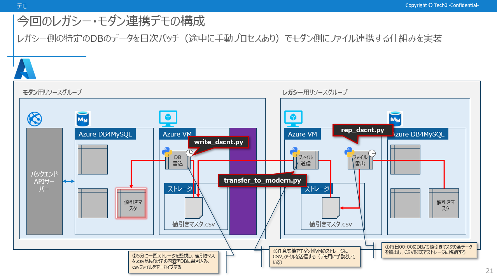

# tech0_file_transfer

## システム構成前提



## 説明

上記画像の

- rep_dscnt.py
- transfer_to_modern.py
- write_dscnt.py

の 3 つのコードがリポジトリに含まれています。

これらは、タスクスケジューラによる定期実行設定をする想定であり、Windows であれば Command Prompt にて下記のようなコマンドを実行することで定期実行タスクとしての登録が可能です。（下記の例では、毎日 00:00 に任意の python ファイルを実行するタスクを登録する例）

```
schtasks /create /sc daily /tn "--任意タスク名称" /tr "python --実行pythonファイルパス" /st 12:00
```
